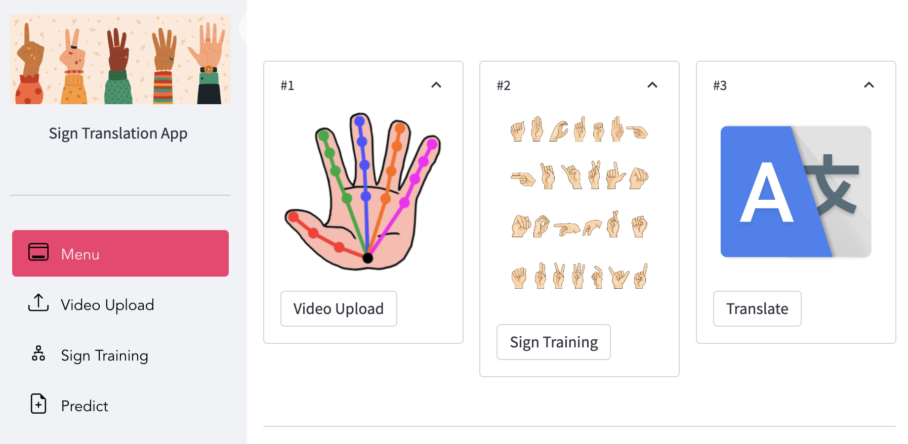

# Sign Language Translation App
[](https://github.com/YttriLab/A-SOID)
[](https://github.com/YttriLab/A-SOID)

<p align="center">
  
</p>

## Introduction
This no code interface will serve to be a
proof-of-concept for sign language translation across 
English, Spanish, and Chinese.

## Installation
```commandline
conda env create environment.yaml
conda activate hands
```

## Usage
```commandline
cd semi-supervised-ASL
streamlit run hands.py
```
The streamlit app composes of 3 main modules.


<p align="center">
  
</p>

* Upload video to obtain pose.
* Train a neural network that recognizes sign langugage.
* Translate into other languages.


## References

